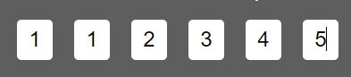

# EZ OTP INPUT for Blazor 

## Overview
EZ OTP Input is an easy way to interact with users to enter their one time password to validate any kind of information required or to have 2 factor authentication.




## Features
- Paste data from clipboard
- Can create as many input as you like
- Fire a call back function with the OTP entered.


## Ussage 

- Add the custom.js to your public folder
- Add the script to your index.html `<script src="custom.js"></script>`
- Move the EventHandler.cs anywhere you like and change the namespace
- Copy the OTP.razor and OTP.razor.css anywhere in your application
- Call the OTP input from anywhere using the example below.
```html
<OTP
    InputLength="6"
    HasError="false"
    CallBack="@OtpInput"
/>
```


## Credits
This module was inspired and created by [@jerryurenaa](http://jerryurenaa.com)


## License
EZMAIL is [MIT](https://github.com/Nerdtrix/FetchAsync/blob/main/LICENSE.md) licensed.


###### Powered by [Nerdtrix.com](http://nerdtrix.com) | Reinventing the wheels for a better future!